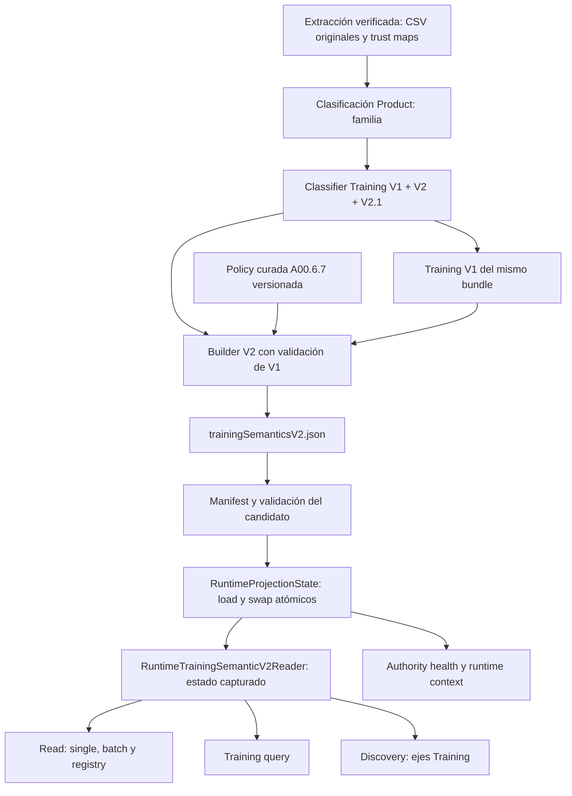

# CAT-V2 P2.2B — Training Semantics V2 Authority Audit

Fecha: **2026-10-05**. Baseline: `8ced63b062185fdd66c9c64c909dbf525b664184`.

**Decisión: `RETIRE`**, aplicada al wiring runtime de Training V2 en este checkout. El store/publisher legacy continúa como herramienta offline de reproducción y fixture; bootstrap ya no lo abre. La validación aquí es local, sin deployment ni activación de producción. Estado final de los gates: [closure](CAT_V2_P2_2B_CLOSURE.md).

## 1. Arquitectura anterior y final

Antes, `build-projection-bundle.ts` publicaba Training **V1** bajo `trainingSemantics.json`. Paralelamente, `src/bootstrap.ts` abría `FileTrainingSemanticSnapshotV2Store(<training-dir>/v2)` y refrescaba `DefaultActiveTrainingSemanticSnapshotV2Reader`. APIs y discovery consumían ese segundo reader. V1 y V2 tenían contratos, snapshots y autoridades diferentes.

Ahora:



`trainingSemantics` sigue siendo V1 tipado. `trainingSemanticsV2` es una propiedad adicional y explícita. Product Semantics conserva la autoridad y el fallback de P2.2A; sus archivos runtime y su audit no fueron alterados por esta migración.

## 2. Matriz de productores, consumidores y contratos

| Área / archivos | Antes | Después / dependencia |
|---|---|---|
| `scripts/training-semantic-snapshot/build-training-semantic-snapshot-v2.ts` | Publisher legacy, save + activate en directorio V2 | Offline/fixtures; conserva el gate del V1 aceptado y usa la misma policy curada |
| `src/infrastructure/training-semantic/fileTrainingSemanticSnapshotV2Store.ts` | Store runtime y offline | Offline/fixtures; sin import ni instancia en bootstrap |
| `src/domain/training-semantic-snapshot/v2SnapshotBuilder.ts` | V1 aceptado fijo + resultados V2.1 | `.build()` preserva el gate legacy; `.buildProjection()` verifica el V1 real del bundle |
| `scripts/catalog-v2/build-training-semantics-v2.ts` | No existía | Construye V2 desde inputs de extracción; declara hashes y cohort curado |
| `src/domain/training-semantics-v2/{contracts,registry}.ts` | Registry compilado V2 | Misma autoridad `code-training-semantic-registry-v2`, códigos y hash |
| `DefaultTrainingSemanticReadService` | `ActiveTrainingSemanticSnapshotV2Reader` legacy | Mismo port, inyectado `RuntimeTrainingSemanticV2Reader` |
| `DefaultTrainingSemanticQueryService` | Índice legacy, cache por snapshot/registry | Índice de V2 CAT-V2; invalidación existente por snapshot/registry |
| `DefaultSemanticDiscoveryService` | Reader Product + reader Training legacy | Mismo reader Product, Training V2 del estado capturado; Producto solo no requiere Training |
| `src/bootstrap.ts`, `src/server.ts` | Dos cargas de snapshots independientes | Bootstrap construye un reader Training V2 ligado al manager; server conserva servicios/ports |
| `CatalogRuntimeProductContextService` | Training V2 legacy/pending junto a V1 CAT-V2 | V2 native/complete, con snapshot, projection, bundle, activation y loadedAt |
| `getCatalogAuthoritySnapshot` | `legacy-training-v2`, `PENDING` | Estado capturado native, `COMPLETE`, READY/UNAVAILABLE y lineage |
| `collectRuntimeReadinessChecks`, `/health/projections` | Training readiness por metadata legacy | Metadata del reader native; readiness V1 y V2 separadas en el manager |
| `src/shared/metrics.ts` | Contadores/duración de Training query y discovery, con snapshot IDs | Mismos nombres/labels; emiten IDs de V2 CAT-V2 a través del mismo servicio |
| Rutas `getTrainingSemantic{Product,Batch,Registry}Route.ts`, `queryTrainingSemanticsRoute.ts`, `semanticDiscoveryQueryRoute.ts` | Contratos HTTP existentes | Schemas idénticos; mismas respuestas 200/400/401/404/409/503 |
| `client/{catalogClient,semanticDiscoveryContracts,semanticDiscoveryCapability,types}.ts` | Registry/discovery y pinning por snapshot | Contratos sin cambios; lineage Training usa el snapshot V2 native |
| `pretest`, `.test-v1`, fixtures y tests legacy | Reproducción del snapshot aprobado | Se mantienen; validan backwards compatibility contractual offline |
| Audit CLI nuevo | No existía | Verifica bundle y snapshot aceptado; reproduce baseline y compara cada producto |

No se inspeccionaron servicios externos ni el deployment actual. La compatibilidad de clientes se demuestra en los contratos y pruebas de este repositorio.

## 3. V1 frente a V2: contrato y mapa de derivación

V1: `schemaVersion="1"`, registry V1, classifier V1.1, `sourceProductSemanticSnapshotId?`, checksum/ID/counts y `records[].assignments[]`. Cada asignación publica capability, relación DIRECT/SUPPORTED, confianza, evidencia, review, módulo/modificadores opcionales. `coverageStatus` y warnings permanecen por producto.

V2: `schemaVersion="2"`, registry V2, classifier V2.1, `sourceV1SnapshotId`, `classifierV2RulesHash`/`rulesHash`, checksum/ID/counts y `records[]` con **dos arrays**: `exerciseCapabilities[]` y `trainingFunctions[]`. Agrega resolución, `resolved`, cohort curado y provenance de cada asignación. La anatomía se deriva al leer, desde registry.

| Concepto / campo V2 | V1 | V2 / derivación | Information loss al usar solamente V1 | Requisito de autoridad |
|---|---|---|---|---|
| `productId` y universo | Presentes | `DIRECT_FROM_V1`, corroborado contra inputs originales | No, si universo coincide | Mismos IDs de V1, V2 y Product del bundle |
| Ejercicios V1, relación/confianza/evidence/review/module/modifiers | `assignments[]` | `DIRECT_FROM_V1`, preservados en `exerciseCapabilities[]` | No para ese subconjunto | Igualdad canonical de todas las asignaciones V1 |
| Ejercicios adicionales V2/V2.1 | Ausentes | `CURATED_RULE` + `EXTERNAL_INPUT` originales; ejecución determinística | Sí: capacidades adicionales y evidencia original | Reglas compiladas existentes, originales y hash |
| `trainingFunctions[]`, relación DIRECT/FAMILY_DERIVED y `productFamily?` | Ausentes | `CURATED_RULE` / `REGISTRY_DERIVED` + familia y evidencia originales | Sí: función, relación y fundamento | Registry V2 y reglas; sin inferir ejercicios nuevos desde familia |
| `coverageStatus` | Presente | `DIRECT_FROM_V1` salvo gate de review determinístico V2 | No; conservar su significado existente | No reinterpretar UNMODELED como absence of V2 assignments |
| `resolutionState` | Ausente | `EXTERNAL_INPUT` curado A00.6.7; fuera de cohort, `DETERMINISTIC_DERIVATION` desde resultado | Sí: resolución curada/ambigüedad/gaps | Policy versionada y defaults aprobados |
| `resolutionEvidence?` | Ausente | `EXTERNAL_INPUT` opcional del builder | `NOT_DERIVABLE` desde V1; publisher aceptado no la suministra | Sin inventar evidencia adicional |
| `resolved` | Ausente | `DETERMINISTIC_DERIVATION`: COMPLETE o VERIFIED_NO_APPLICABLE | Sí si solo se usa coverage V1 | UNKNOWN/ambiguity/gap conservados |
| `activeTrainingRelevant` | Ausente | `EXTERNAL_INPUT`: membership del cohort de revisión A00.6.7 | `NOT_DERIVABLE` desde V1 o estado live | Metadata histórica; no es sellability ni active actual |
| `warnings` | Presentes parcialmente | `DIRECT_FROM_V1` + `DETERMINISTIC_DERIVATION` V2 | Sí, advertencias específicas V2 | Conservar y ordenar canonicalmente |
| Provenance de asignación | No se persiste en V1 | `CURATED_RULE` y contexto `EXTERNAL_INPUT` del classifier; fecha eliminada por builder | `NOT_DERIVABLE` íntegramente desde artifact V1 | Classifier/source/override se preservan; container lineage separado |
| Anatomía: body regions, músculos, patterns | Derivados de registry V1 al leer | `REGISTRY_DERIVED` de capability V2 al leer | Sí para capabilities ausentes en V1 | Registry compilado V2 idéntico al del builder |
| `schemaVersion`, `registryVersion`, `registryHash` | Schema/registry V1 | Contrato y `REGISTRY_DERIVED` de V2 | No convertir strings V1 en V2 | Version/hash V2 explícitos y verificados |
| `classifierVersion`, `classifierV2RulesHash`, `rulesHash` | Classifier/rules V1 | `CURATED_RULE`: V2.1 y hash computado | `NOT_DERIVABLE` desde snapshot V1 | Ambos hashes de rules V2.1 validados |
| `sourceV1SnapshotId` | ID V1 disponible | `DIRECT_FROM_V1` real, verificado | No | Sin fingir el ID legacy aceptado para extracción nueva |
| `counts` | Coverage y asignaciones V1 | `DETERMINISTIC_DERIVATION`, separa global/cohort/provenance | Sí si se copian counts V1 | Recomputación completa y consistencia de identity |
| `semanticChecksum`, `snapshotId` | Hashes V1 | `DETERMINISTIC_DERIVATION` de records/counts/registry/rules/source | IDs no intercambiables | Hash canonical y validator V2 |
| `generatedAt`, `activatedAt?` | Metadata operacional | `EXTERNAL_INPUT` temporal; artifact native usa epoch fijo, activación vive en state | No valor semántico perdido | Excluidos de comparación semántica; loadedAt real separado |
| Wrapper `sourceExtractionId`, `codeRef`, `inputs` | Manifest/source externos | `EXTERNAL_INPUT`, hashes de CSV/maps/policy y código | No disponibles desde snapshot V1 aislado | Verificación de extracción y manifest |
| Projection ID | No es snapshot ID V1 | `DETERMINISTIC_DERIVATION`: manifest entry `snapshotId=semanticHash(wrapper)` | No se debe reutilizar el ID V1 | Identidad de artifact separado del snapshot V2 interno |

**V2 no se construye completamente desde V1.** El classifier V2 vuelve a ejecutar el classifier V1 sobre inputs originales y añade sus reglas; el builder corrobora preservación contra el snapshot V1 proporcionado. V1 aislado no contiene nombres, categorías/features completos ni resoluciones curadas.

### Inputs y estado mutable

- Legacy: CSV archivados `docs/audits/product-intelligence-exploration/inputs/{product_catalog_exploration(2),category_trust_map(1),feature_trust_map(1)}.csv`.
- Native: `product_catalog_exploration.csv`, `category_trust_map.csv`, `feature_trust_map.csv` de una extracción ya verificada.
- Ambos: `docs/audits/training-semantics/a00.6.7/post-closure-resolution-active.csv`, 240 IDs únicos y counts aprobados.
- `loadTrainingSemanticClassificationInputs` usa Product classification para obtener familia; no llama al reader runtime de Product Semantics ni abre su fallback.
- Conserva categorías/features originales y campos revenue/active/presence. Revenue y estado comercial no son criterios de clasificación Training; no consulta SQL, stock, precios ni sellability en el builder/reader V2. La extracción captura datos fuente, no consolida Commercial Truth.
- Reglas V2 compiladas: ejercicios explícitos, funciones explícitas y derivación de funciones aprobadas por registry. V2.1 añade enriquecimientos de módulos duales y geometría de cable. No se modificaron reglas, códigos o vocabulario.
- Las fechas operacionales y active pointers son mutables, pero no cambian la semántica reproducida. La policy curada tiene hash declarado y queda congelada dentro del artifact publicado.

## 4. Reproducibilidad e identidades verificadas

Evidencia: [parity por producto](evidence/training-v2-parity.json) y [reproducción de artifacts](evidence/training-v2-reproducibility.json).

| Identidad | Valor |
|---|---|
| V1 legacy aceptado | `sha256:63fd41033347c4bd4bcc6382ce432a8a5d0876c8de0a5bec2dd54ac9297ab90d` |
| V2 legacy aceptado, leído y reproducido | `sha256:045f04fb739218e24e6ffcbd27560df94b21d91c26f0e84befebf9696622c5c1` |
| Legacy V2 semantic checksum | `e15673be136a730d3e90645446ba55f0734b491163f47b4a617b9c5c974f8941` |
| Legacy V2 bytes canonical con generatedAt fijo | `sha256:57ec370d6f54347d56e952b6b1e934228e3bbadd41a17b5a2fbfd1b5a5f9d414` |
| Resolution policy hash | `sha256:4788d5e878152b36b39e830e61d8b80f43871b8579304ab453904961bb920e2e` |
| Registry version | `training-semantic-registry-v2` |
| Registry hash | `7f7c6e88f31a7e4be4fb03761b58b380c6b37070297172a713b2d8a5ba9f14f8` |
| Classifier | `training-semantic-classifier-v2.1` |
| Rules hash | `5e4e591b45e7704975552f305d59d73535c3889ed655754aa0113844c9c03b6d` |
| Source extraction | `sha256:3694b291c89d5f011904b44dc7fe51eb6f355da63d5bb25c485009fadd67d007` |
| Native V1 source snapshot | `sha256:414441d0939fcec5aac07dd377b6409d9b283cca6cc5be9a19cd0d1815c906c3` |
| Native bundle | `sha256:ee4881b5875ee098c8b54c5ee6dfdcd4d4a92d8c91263bd4ce02c1b5e8e0a347` |
| Native V2 projection ID | `sha256:4f5cdc689d07f867c0b571a17150d323967e93ebb9e19a31506eac444b3beb7c` |
| Native V2 artifact content hash | `sha256:e8afff3e409de25701b66ad22f3a0a5467d2fff01767da1deb5fd35a781730a6` |
| Code content ref | `sha256:bc983194b0e9dad704753eeadd6f7278d9916eefe4b041c204c8ed8273f2c5e8` |

El code ref fue calculado por el builder desde contenido de `src`, `scripts` y `package-lock.json`, no atribuido al commit baseline. Los hashes de todos los inputs legacy y native están en el reporte de parity.

`pretest` reproduce V1 en `.test-v1` y V2 con el publisher aprobado. El audit vuelve a construir V2 dos veces con generatedAt fijo y exige el ID aceptado y bytes iguales. Compara el snapshot persistido contra esa reproducción eliminando solamente generatedAt/activatedAt operacionales. No depende del active pointer legacy para seleccionar el baseline.

La extracción completa fue construida en **dos procesos independientes**, bajo `p2-2b-final` y `p2-2b-final-replay`, con mismo code content ref: mismo bundle ID y bytes de los cinco artifacts. Solo manifest builtAt y duraciones del validation report varían. V2 ocupa 675921 bytes. Los cuatro artifacts previos son además byte por byte iguales a Phase 1 `sha256:8401b8853b327c84b71c2c3dfa03b9bd5e78bcb7e5b8c254ca89f2a48aef5017`.

## 5. Coverage y parity

| Métrica global | Legacy aceptado V2 | CAT-V2 V2 |
|---|---:|---:|
| Total records | 2011 | 2048 |
| Resolved: COMPLETE + VERIFIED_NO_APPLICABLE | 1250 | 1275 |
| SEMANTIC_COMPLETE | 381 | 388 |
| VERIFIED_NO_APPLICABLE_CAPABILITY | 869 | 887 |
| SEMANTIC_PARTIAL | 0 | 0 |
| Unknown/unresolved, sin partial | 761 | 773 |
| ONTOLOGY_GAP | 742 | 753 |
| DATA_GAP | 15 | 16 |
| AMBIGUOUS | 4 | 4 |
| NEEDS_REVIEW / RULE_GAP | 0 / 0 | 0 / 0 |
| Excluded | No existe enum | No existe enum |
| Productos con exercise capability | 231 | 233 |
| Exercise assignments | 275 | 277 |
| Productos con training function | 254 | 260 |
| Function assignments | 282 | 289 |
| Asignaciones V1 preservadas | 180 | 182 |
| Asignaciones de closure V2 | 90 | 90 |
| Asignaciones adicionales V2.1 | 5 | 5 |

`excluded=null` significa categoría no definida, no un conteo inventado. VERIFIED_NO_APPLICABLE es una negativa verificada; UNKNOWN conserva gaps/ambigüedad, no se convierte en falsa negativa. `coverageStatus` permanece el valor histórico V1 incluso si V2 añade asignaciones: copiarlo no implica ausencia de capability V2.

Los counts `resolvedCount`, `unresolvedCount`, `resolutionStateCounts` del snapshot se refieren al **cohort curado de 240**, no a todos los records. Ambos conservan: 122 COMPLETE, 112 VERIFIED_NO_APPLICABLE, 2 DATA_GAP, 4 AMBIGUOUS; resolved=234, unresolved=6 y resolutionRate=97.50%.

Parity:

```text
classification = CAT_V2_SUPERSET
both = 2011
legacyOnly = 0
candidateOnly = 37
exactRecordMatches = 1579
equivalentRecordMatches = 2011
materialDifferences = 0
lineageOnlyDifferences = 432
```

La comparación conserva relación, confidence, evidence/rule IDs, review, módulos/modificadores, warnings, resolution, resolved y membership. Solamente excluye `sourceCatalogExport` y `sourceProductSemanticSnapshotId` de provenance de asignación: cambia el contenedor de origen. No ignora classifierVersion, override ni evidencia. El JSON enumera IDs, valores completos de cada diferencia y populations. Los 37 adicionales aportan 7 COMPLETE, 18 negativas verificadas y 12 unknown; no degradan ninguno de los 2011 compartidos.

## 6. Contrato CAT-V2 V2 y registry

`src/domain/catalog/training-semantics-v2-projection.ts` reutiliza `trainingSemanticSnapshotV2Schema`, sin duplicar records ni vocabulario:

```ts
type TrainingSemanticsV2Projection = {
  schemaVersion: '2';
  sourceExtractionId: string;
  codeRef: string;
  inputs: {
    catalog: string; categoryTrustMap: string; featureTrustMap: string;
    resolutionPolicy: { file: string; hash: string; cohort: 'accepted-a00.6.7' };
  };
  snapshot: TrainingSemanticSnapshotV2;
};
```

Registry version/hash, rules, sourceV1, records/counts y semantic identity viven en `snapshot`. Projection ID vive en la entry del manifest; `snapshot.snapshotId` identifica el snapshot interno. No hay dos campos de projection ID que puedan discrepar.

El builder y el runtime dependen del mismo registry V2 compilado: classifier publica códigos, reader deriva anatomía, query/discovery validan códigos y relaciones. Un hash/version incompatible se rechaza antes del swap. No se copiaron definiciones dentro de cada record ni se añadieron códigos.

## 7. Manifest y validación

Manifest schema **1** conserva `trainingSemantics` schema **1**. Añade `trainingSemanticsV2?` como discriminated union: present schema **2** o unavailable explícito. No añade default para ausencia; IDs de manifests Phase 1 existentes no cambian.

Cuando V2 está presente se exige artifact, content hash, projection ID canonical, schema/count/classifier, registry/rules, identidad de snapshot, extracción/code ref, trust input hashes, mismo universo de productos, vínculo al V1 real y preservación de todas sus asignaciones. Declarar V1 con otro ID no permite fabricar lineage: se valida también la identidad del snapshot V1.

El publisher conserva inmutabilidad de archivos existentes y solo escribe un nuevo bundle. ActivationService y el store distinguen versiones por nombre: V1/otros=1, Training V2=2. Un archivo inválido o faltante no se acepta simplemente por contar con un validation-report previo PASS.

## 8. Runtime, authority y failure semantics

`RuntimeProjectionState.trainingSemanticsV2` contiene el wrapper validado, congelado, o null. Se construye antes del swap junto a Product/V1/specs/trust maps. El manager conserva last good state al fallar, fence de reload obsoleto, backoff y AsyncLocalStorage por request. Rollback vuelve a cargar toda la semántica del bundle destino.

`RuntimeTrainingSemanticV2Reader` cumple el port V2 existente. Metadata, single y bulk usan `forRequest()`. Clona resultados para preservar inmutabilidad; anatomía se deriva del registry existente. No contiene store legacy, clasificador runtime, SQL, sustitución V1 ni Product.

| Situación | Training V2 | Commercial Truth |
|---|---|---|
| Bundle validado con V2 | CAT-V2 READY | Reader PrestaShop existente |
| Phase 1 sin V2 / unavailable explícito | Metadata null; typed unavailable; read/query/ejes Training discovery 503 | Sigue disponible |
| Sin active bundle | V2 UNAVAILABLE, sin fallback | Readiness comercial independiente |
| Candidato V2 corrupto tras activación con B1 ya cargado | Conserva V2 de B1; projection runtime DEGRADED | Sigue disponible |
| Arranque con V2 inválido y sin last good | Sin estado cargado; typed unavailable | Sigue independiente |
| Producto ausente de un V2 válido | Null / HTTP 404; batch missing IDs | Sin consulta legacy |
| Pin de snapshot anterior tras reload | HTTP 409 | Sin efecto |
| UNKNOWN/ambiguous/gap en record | Conserva resolutionState; queries mantienen eligibility COMPLETE | Sin inferir stock/sellability |

`GET /health/catalog-authority` publica autoridad `cat-v2-training-semantics-v2`, migrationStatus `COMPLETE`, status READY/UNAVAILABLE, snapshotId, projectionId, projectionBundleId, activationId y loadedAt. V1 sigue visible bajo `trainingSemanticsV1CatV2`. Runtime context incluye la misma lineage y migrationStatus `complete`. COMPLETE expresa finalización del wiring; una instalación con bundle antiguo puede continuar UNAVAILABLE.

## 9. Gate y decisión

| Gate | Resultado |
|---|---|
| Contrato V2 compatible | PASS: mismo schema interno y mismas rutas/contracts HTTP |
| Reproducibilidad | PASS: snapshot aceptado, bytes normalizados y builds independientes |
| Coverage | PASS: todos los IDs legacy, sin degradación; 37 adicionales |
| Parity semántica | PASS: 2011 equivalentes, cero diferencias materiales |
| Lineage/registry | PASS: fuente V1 real, asignaciones, inputs, código, hashes |
| Consumidores | PASS: reader native inyectado en read/query/discovery/context |
| Reload/rollback/capture | PASS: acceptance HTTP en una sola instancia |
| Failure/backwards compatibility | PASS: missing/invalid V2, Phase 1, last good y aislamiento comercial |

**Una decisión: `RETIRE`**. `legacy Training V2 runtime authority = NONE` en la implementación final. Los fixtures/offline publishers siguen disponibles para reproducir y comparar evidencia.

## 10. Diff por archivo de P2.2B

| Archivo | Cambio |
|---|---|
| `package.json` | Command `catalog:training-v2:authority-audit` |
| `scripts/catalog-v2/build-training-semantics-v2.ts` | Policy compartida validada + builder native original-input |
| `scripts/catalog-v2/build-projection-bundle.ts` | Publica artifact/entry/versión V2 separados |
| `scripts/catalog-v2/audit-training-semantics-v2-authority.ts` | Reproduce baseline, valida candidato y emite parity/coverage determinístico |
| `scripts/training-semantic-snapshot/build-training-semantic-snapshot-v2.ts` | Reutiliza lector policy; publisher offline conserva gates aprobados |
| `src/domain/catalog/training-semantics-v2-projection.ts` | Wrapper V2 tipado y schema |
| `src/domain/catalog/projection-bundle.ts` | Entry opcional V2 + validación contractual y lineage |
| `src/domain/catalog/projection-activation.ts` | Compatibilidad de runtime por versión explícita |
| `src/infra/catalog/file-projection-activation-store.ts` | Versión V2 diferenciada y entradas opcionales |
| `src/domain/catalog/runtime-projection.ts` | Estado V2 congelado, load atómico, readiness separado |
| `src/domain/catalog/runtime-training-semantic-v2-reader.ts` | Reader V2 exclusivo del estado capturado |
| `src/domain/training-semantic-snapshot/v2SnapshotBuilder.ts` | Entry native con source real, validator V1 lineage reutilizado; verifica ambos rules hashes |
| `src/domain/training-semantic-snapshot/v2Runtime.ts` | Exporta la derivación existente de fact para reutilización |
| `src/bootstrap.ts` | Sustituye carga legacy por reader native |
| `src/domain/catalog/runtime-authority-contract.ts` | Native authority COMPLETE y lineage V2 |
| `src/application/catalog/runtime-context/catalogRuntimeProductContextService.ts` | Context V2 native/complete y bundle lineage |
| `src/application/catalog/runtime-context/catalogAuthoritySnapshot.ts` | Health desde snapshot V2 capturado |
| `tests/unit/trainingV2AuthorityParity.test.ts` | Derivación original, determinismo, gates, parity material, unknown y reproducción aceptada |
| `tests/integration/projectionBundleReplay.test.ts` | Incluye V2 y comparación de bytes en replay existente |
| `tests/integration/projectionRuntimeHotReload.test.ts` | HTTP Training read/query/discovery/health, capture, rollback; Phase 1 y V2 inválido |
| `tests/unit/catalogRuntimeProductContextService.test.ts` | Native context y lineage B1/B2/rollback; commercial isolation |
| `tests/unit/catalogAuthoritySnapshot.test.ts` | Autoridades V1/V2 native separadas |
| `tests/http/catalogAuthorityEndpoint.test.ts` | Authority COMPLETE y lineage |
| `docs/catalog-v2/evidence/training-v2-parity.json` | Resultado por producto y hashes fuente |
| `docs/catalog-v2/evidence/training-v2-reproducibility.json` | Builds independientes y estabilidad Phase 1 |
| Este audit y `CAT_V2_P2_2B_CLOSURE.md` | Trazabilidad y cierre de implementación |

El historial se cierra en dos commits separados: P2.2A audit / RETAIN_TEMPORARILY y P2.2B Training V2 authority migration. Los scripts, reporte y tests propios de P2.2A se conservan en el primer commit. Las dos pruebas de integración compartidas se extendieron para V2 en el segundo commit conservando sus verificaciones Product.

## 11. Pruebas y reproducción

Ver resultados finales de typecheck, build, suite completa y diff-check en [closure](CAT_V2_P2_2B_CLOSURE.md). La suite específica de build/parity/hot reload pasó 17 pruebas. Las pruebas cubren determinismo incluso al reordenar input, V1 actual y publisher legacy estricto, deriva material de evidence/confidence/review/resolution, pérdida/adición de IDs, registro UNKNOWN, snapshot aceptado y todos los casos de la tabla de failure semantics.

Acceptance usa tres bundles publicados en procesos separados, elimina el source archivado y mantiene una instancia HTTP: B1 expone LEG_PRESS; B2 expone ROW; rollback recupera exactamente respuestas Training read/query/discovery de B1. Durante promoción una request capturada conserva IDs y capability de B1. Validación rechaza registry hash/version, rules, counts, source, code ref, schema, archivo faltante y evidencia V1 alterada aun con hashes de contenedor e identidad recalculados.

Comandos desde la raíz:

```powershell
npm run test:bootstrap:training-v2
npm run catalog:bundle:build -- --source-dir=artifacts/catalog-projection-input/36ef08110d3444e750c5c94b00009777425d8f86c9e77d6c55bc39d0f180aef2 --output-dir=artifacts/catalog-v2/p2-2b-final/bundles
npm run catalog:training-v2:authority-audit -- --projection-root=artifacts/catalog-v2/p2-2b-final --bundle-id=sha256:ee4881b5875ee098c8b54c5ee6dfdcd4d4a92d8c91263bd4ce02c1b5e8e0a347
npm run typecheck
npm run build
npm test
git diff --check
```

El CLI admite `--legacy-dir`, `--source-v1-dir` y `--output`. Exit 0=parity suficiente, 2=drift material/coverage, 1=inputs/identidad inválidos o V2 ausente. Artifact directories son locales ignorados por Git; JSON de evidencia y fixtures/tests son versionables.

## 12. Compatibilidad de bundles y deployment

Phase 1 B1 sigue siendo válido: el schema no inyecta V2 ni recalcula su identidad. Puede activarse y cargarse; V1/Product/specs/trust maps están READY y V2 queda UNAVAILABLE. La ausencia tiene significado explícito, sin reinterpretación de V1.

Para servir Training V2 después del deployment debe publicarse y activarse un bundle con la nueva entry usando runtime/CLI que soporte schema V2. Desplegar solo el código con el antiguo B1 deja Training V2 no disponible. Esta task produce implementación y candidato verificable; no cambia el pointer productivo ni afirma validar producción. Coordinación de deployment/activation y validación live quedan pendientes fuera del cierre local.

## 13. Deuda residual

1. **UNKNOWN no resueltos:** 773 en población native; 6 en cohort curado. La consolidación conserva el conocimiento disponible y no cierra ontología/evidencia ausente.
2. **Cohort histórico:** `activeTrainingRelevant` significa cohort aprobado A00.6.7. De sus 240 IDs, 13 no están actualmente activos en la extracción: 258, 486, 487, 489, 491, 494, 1207, 1653, 2018 inactivos; 2188, 2261, 2301, 2302 históricos. No se redefinió membership ni se confundió con Commercial Truth.
3. **Resoluciones curadas dependientes de producto:** permanecen las aprobadas; cualquier futura extracción con cambio material en un ID curado requiere revisión/policy versionada y nuevo audit. Hash y parity hacen visible esa dependencia.
4. **Artifacts/publisher legacy offline:** se conservan para regresión y auditoría; su eliminación física es otra tarea. Ninguno es autoridad runtime tras el nuevo bootstrap.
5. **Operación:** deployment, promoción del candidato, métricas/health live y validación productiva no ejecutados aquí.
6. **P2.2A:** Product Semantics sigue `RETAIN_TEMPORARILY` / `RETIREMENT_BLOCKED`; fallback solo NO_ACTIVE_BUNDLE. Capabilities Projection, Relationships, R4 y Commercial Truth mantienen su scope.

## 14. Closure status

La implementación permite autoridad única de Training V2 native con contrato preservado, parity demostrado y load/swap/rollback atómicos. La decisión RETIRE se refiere a su autoridad runtime en código. [Closure](CAT_V2_P2_2B_CLOSURE.md) registra gates finales y distingue implementación cerrada de producción no validada.
